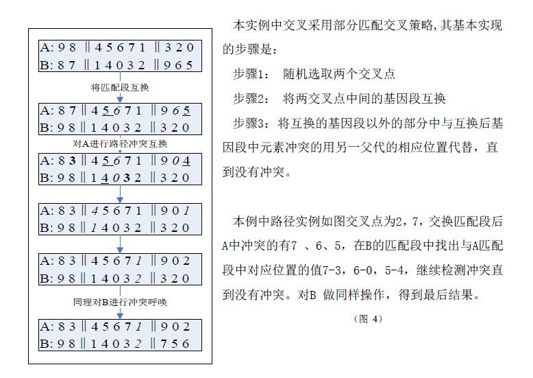
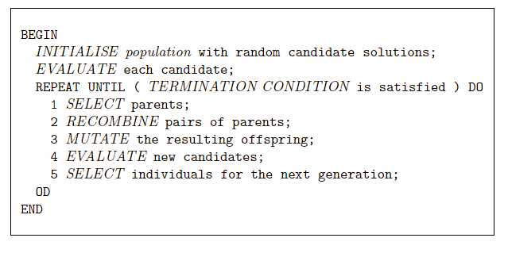
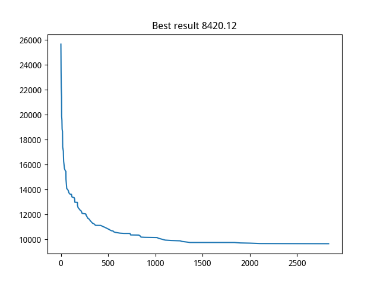
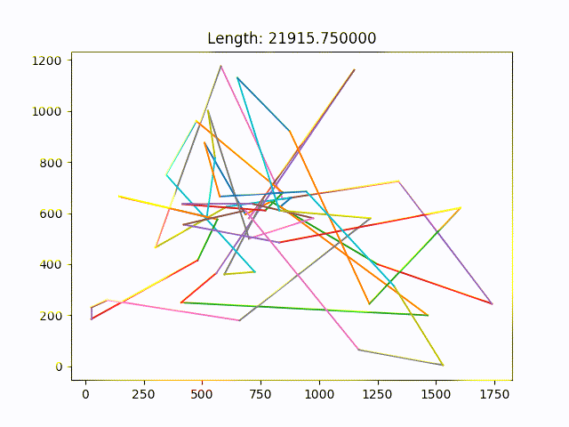
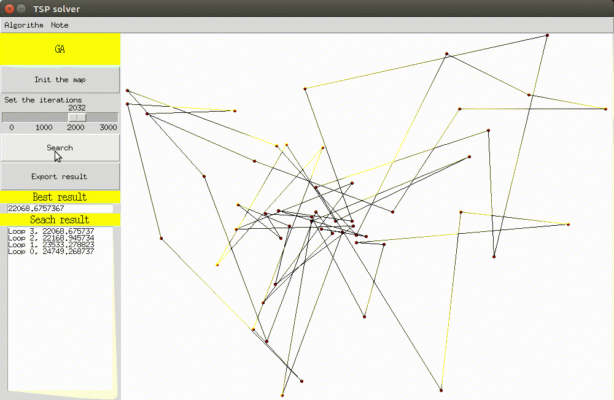

## 遗传算法GA求解TSP问题

---

### 1. 算法原理

1. GA算法是一种根据达尔文的进化学说提出的一种"适者生存，不适者淘汰"的生物进化法则的原理提出的进化计算算法，目的在于利用生物的这种天生的进化原则实行对组合优化问题的优化计算

   **优点**

   * 算法简单易于实现
   * 算法参数非常少，并且非常可控
   * 算法的效果很出色

   **缺点**

   * 算法引入了随机性，没有足够的理论基础
   * 算法发容易收敛到局部最优的情况

2. 算法的主要的流程如下

   * 初始化群体以及群体的初始解

   * 父代选择操作 :

     * 采用概率的方式(轮盘赌)，选择相对足够优秀的父代
     * 选择父代准备进行杂交

   * 子代产生

     * 重组操作 : 随机的两个父代的基因重组
     * 变异操作 : 随机的选择父代的两个位置进行交叉(**这里采用了自己提出的优化方式，效果显著**)

     

   * 群体选择

   * 重复上述过程直到满足终止条件

     

---

### 2. 实验过程和技巧

* 在算法的基础上，自己引入的技巧
  1. 引入**个体死亡策略**
     * 定义每一个群体中的个体都存在一个寿命期限，每一个个体会保证在`5`次迭代后死亡
     * 对优秀个体的保存，每一次将个体中最优秀的个体保存下来，修改其寿命为`inf`,保存优良解的结果和经验
  2. 引入**精英策略**
     * 每一次绝对的选择群体中的前几个直接过渡到下一次迭代中去
  3. 引入**优化变异策略**
     * 对个体的重组率设定在`0.9`
     * 对个体的变异率不做详细设定，但是
       1. 每一次产生子代的时候设定会做`1000`次变异(超参数)
       2. 个体的每一次变异的概率都是当前变异序号的倒数，从而保证学习和搜索的步长不会过长，从而保证算法的可收敛性
* 对采用的技巧的实验效果会在之后做出详细的分析

---

### 2. 结果分析

1. 测试数据

   采用标准的`TSBLIB`数据集，为了清晰的表示，使用了`berlin52`问题作为最终的测试对象，之后的实验数据和分析结果都是建立在`berln52`问题上的，首先`TSPLIB`数据集中的所有数据基本都已经找到了最优解，对于`berlin52`问题的最优解是`7544.12`

2. 实验情况

   * 为了方便实验的数据分析，我自己编写了可视化模块，使用`Python`的`tkinter`完成

   * 实验的结果采用两种方式展示

     * `matplotlib`
     * `tkinter`

   * 解的收敛情况

     

   * 解收敛状况图

     

   * 可视化界面

     

3. 实验结果分析

   1. 为了对实验的最终结果做一个良好的调整，我写脚本对超参数做了验证，并选用了如下的超参数

      * 群体规模稳定在 : `100`
      * 迭代次数 : `1000` ~ `2000`
      * 产生子代的规模是 : `200`
      * 重组概率 : `0.9`
      * 变异
        1. 次数  : `1000`
        2. 变异概率 : $$P = \frac{1}{t}$$

   2. 实验结果

      1. 对死亡策略的实验结果

         * 死亡策略在算法的后期搜索过程中，可以起到加速搜索速度，提高搜索效果的作用

           个人分析可能的原因在于 : 

           真实的模拟了进化的本质，并有效的采用了随机的方式保存了群体中的有力解，淘汰对群体没有帮助的解

         * 精英策略

           精英策略的实验效果并不是很好，实际试验中会发先，经验策略总是使得算法过早的收敛并且降低搜索的效果

           个人分析结果：

           精英策略实际上过分的看中当前群体中出现的近似最优解，并忽视了其他的搜索的途径，使得算法过早的收敛到了局部最优而不能跳出(始终以精英为标准)

         * 优化变异策略

           优化变异策略的效果非常的显著，使用了优化编译策略之后，算法的整体的搜索结果有了明显的提升，和 `PSO` 算法相比，采用优化变异策略后的 `GA` 算法收敛的速度快，收敛的结果好，并且可以观察到，会发生**持续收敛现象**,意味着，我们的迭代次数过少,算法还在继续的收敛

           扩大了算法的 `Explotition` 的能力