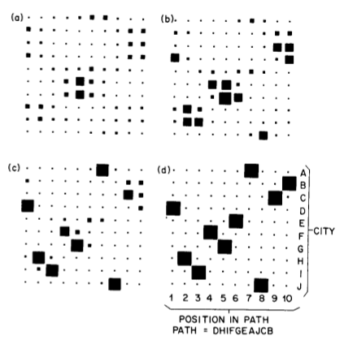
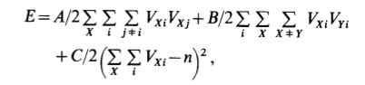
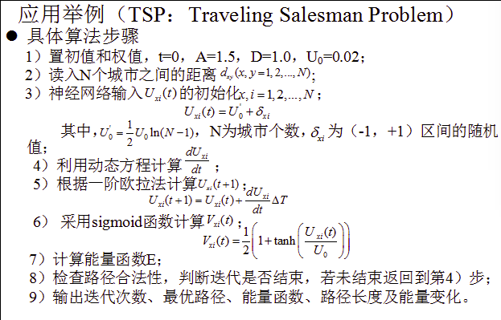
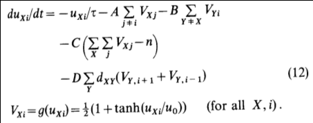
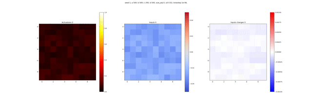
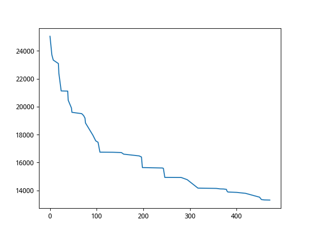
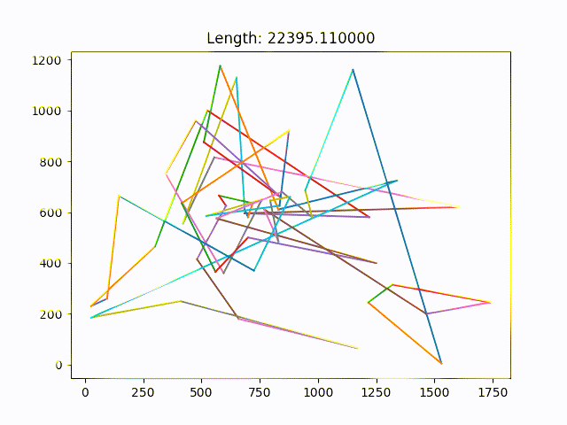

## Hopfield网络求解TSP问题

---

### 1. 算法原理

1. Hopfield算法是利用Hopfield网络的能量函数的递减作用实现的对组合优化问题的最优化计算的

   Hopfield网络是一自反馈稳定的网络，使用**李雅谱诺夫函数**，实现了我们的对网络能连的递减作用

   **优点**

   * 算法保证一定收敛和递减

   **缺点**

   * 算法的参数过多
   * 算法的计算量过大
   * **算法的实际效果不是非常喜理想，论文结果很难复现**

2. 算法

   * 网络设计

     

     * 使用二维的网络矩阵实现对TSP问题的模拟
       1. 每一行表示城市的标号
       2. 每一列表示城市的遍历顺序

   * 能量函数设计

     

   * 算法流程

     

   * 迭代过程

     

---

### 2. 结果分析

1. 测试数据

   Hopfield算法，我编写的结果在大数据上并不能收敛的很好，这里采用算法的实例，展示一下Hopfield算法的实验结果示例图,图中可以清晰的展示在迭代的过程中，算法的收敛状况和神经元的**激活结果**

   

2. 实验情况

   * 解的收敛情况

     可见收敛额结果并不是非常的理想

     

   * 解收敛状况图

     

3. 实验结果分析

   1. 为了对实验的最终结果做一个良好的调整,选用论文中的超参数

      * 1985年Hopfield的论文连接

        [https://www.researchgate.net/publication/19135224_Neural_Computation_of_Decisions_in_Optimization_Problems](https://www.researchgate.net/publication/19135224_Neural_Computation_of_Decisions_in_Optimization_Problems)

      * 超参数

        1. A = B = 500
        2. C = 200
        3. D = 500
        4. $$u_0 = 0.02$$
        5. n = 15

   2. 实验结果

      1. 实验的迭代效果并不是非常很好，但是在小数据集小的实验过程还是比较理想，超参数没有过多的设置和修改，直接选用了1985年作者Hopfield论文中的超参数设计方式，说明该算法的复现效果并不是很好
      2. 实验的计算速度和`PSO`,`GA`算法相比明显的慢
      3. 算法的收敛效果并不是非常好