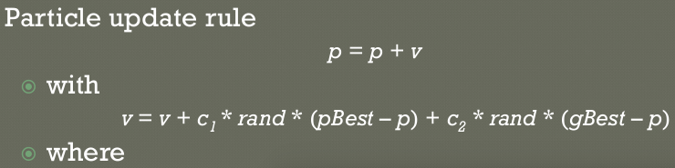
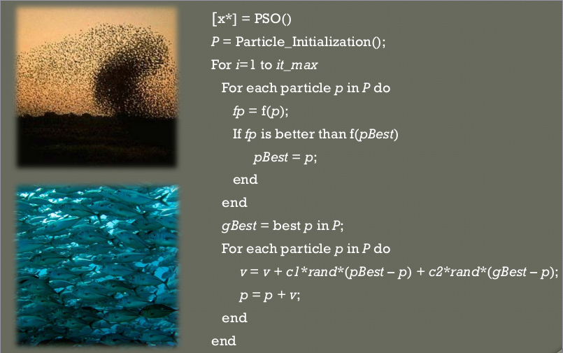
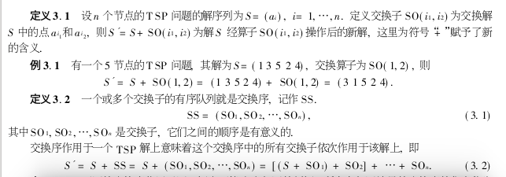
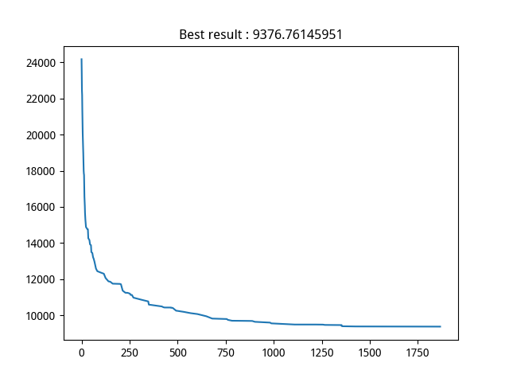
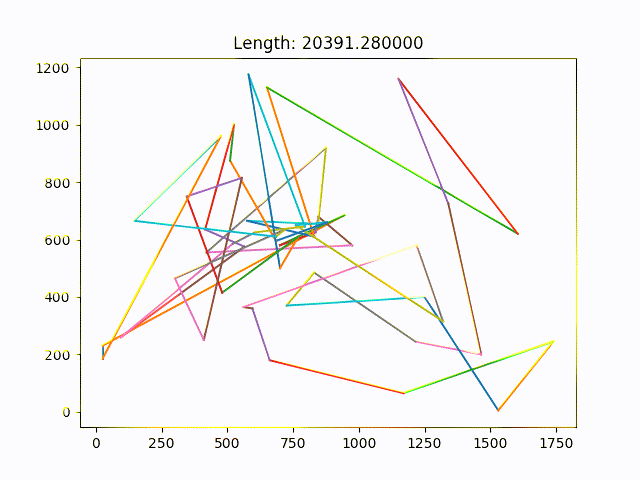

## 群智能算法PSO求解TSP问题

---

### 1. 算法原理

1. PSO算法是一种基于仿生学的群体智能搜索算法，学者充分利用了在搜索过程中的群体智慧和个体的记忆智能实现有组织的搜索过程，是一种功能容易实现并且高效的群体智能算法

   **优点**

   * 算法简单易于实现
   * 算法参数相对较少，易于调整

   **缺点**

   * 算法引入了随机性
   * 算算发容易收敛到局部最优的情况

2. 算法的主要的流程如下

   * 初始化群体，主要包括初始化种群的群体最优解和每个个体的最优解以及速度，等参数

   * 在每一次迭代过程中查询所有的粒子适应度并更新个体的最优适应度

   * 每一次迭代查找群体的最优适应度

   * 按照当前的群体中的群体最优解和没个够给提的最优解作为搜索信息，更新个体的速度和状态

     

   * 重复上述过程直到满足终止条件

   

---

### 2. 实验过程和技巧

* 针对TSP问题的具体分析
  首先需要引入一篇论文 

  * 文献编号 : `1671-5489( 2003) 04-0477-04`

* 在论文中，作者针对PSO解决TSP问题，引入了一种定义问题的方式

  * 交换子和交换序

    

  * 速度变换公式定义

    $$V^{t+1} = V^t + \alpha * SO + \beta * SO$$

    * 速度选取中从每一组交换序中选择抽取其中的部分作为最终的交换序
    * 将交换序传递给沃尔玛的序列做交换操作(即所谓的速度变换公式)

  * 定义解的描述形式

    1. 使用对城市的编排顺序描述我们的其中一个解
    2. 使用遍历城市的总距离表示适应度函数(**fitness function**)
    3. 交换子和交换序的表示对解的改变和扩展操作

---

### 2. 结果分析

1. 测试数据

   采用标准的`TSBLIB`数据集，为了清晰的表示，使用了`berlin52`问题作为最终的测试对象，之后的实验数据和分析结果都是建立在`berln52`问题上的，首先`TSPLIB`数据集中的所有数据基本都已经找到了最优解，对于`berlin52`问题的最优解是`7544.12`

2. 实验情况

   * 为了方便实验的数据分析，我自己编写了可视化模块，使用`Python`的`tkinter`完成

   * 实验的结果采用两种方式展示

     * `matplotlib`
     * `tkinter`

   * 解的收敛情况

     

   * 解收敛状况图

     

   * 可视化界面

     

3. 实验结果分析

   1. 为了对实验的最终结果做一个良好的调整，我写脚本对超参数做了验证，并选用了如下的超参数

      * 群体规模 : `200`
      * 交换子中，选用 `0.42` 从 `pbest` / `gbest` 中选择的一个概率标准

   2. 实验结果

      和数据集的最终结果相比，实验结果存在部分差距，原因分析如下

      * 实验的超参数选定的不充分

      * 群体选取的规模不是很充分

      * **PSO问题在TSP问题上的速度定义公式选取并不是非常的适合问题的表述形式**

        在这一点上，我做了很多的思考，如果一个问题的表达方式和算法的运算迭代方式比较吻合的话，我们的算法的效果将会非常的出色